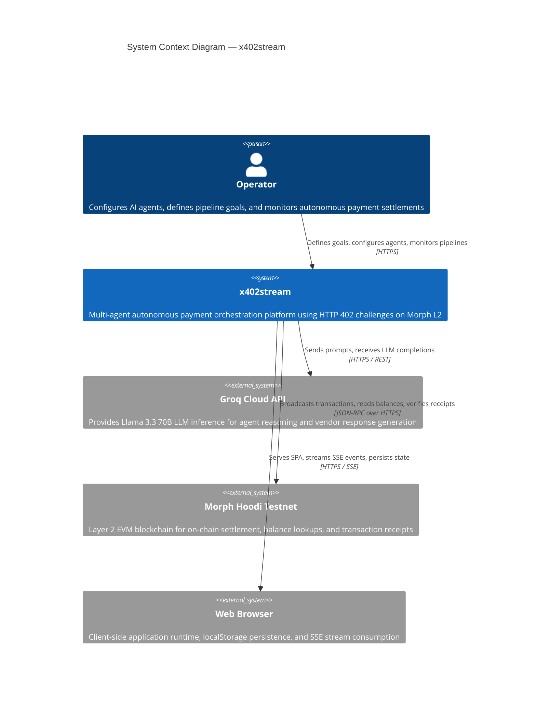
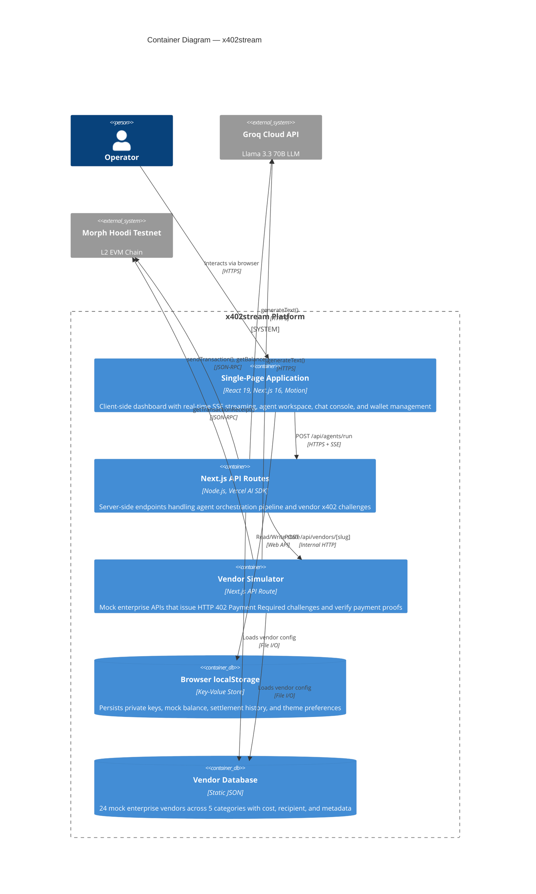
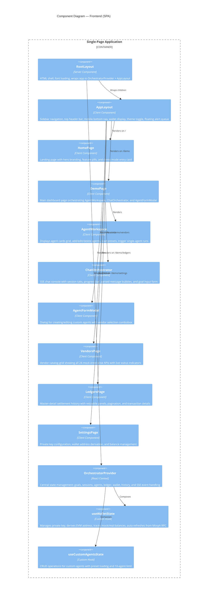
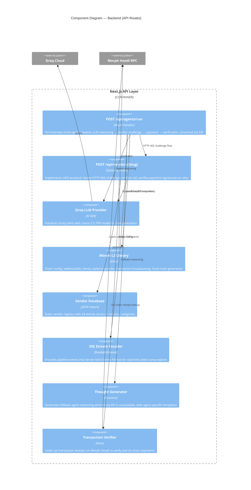
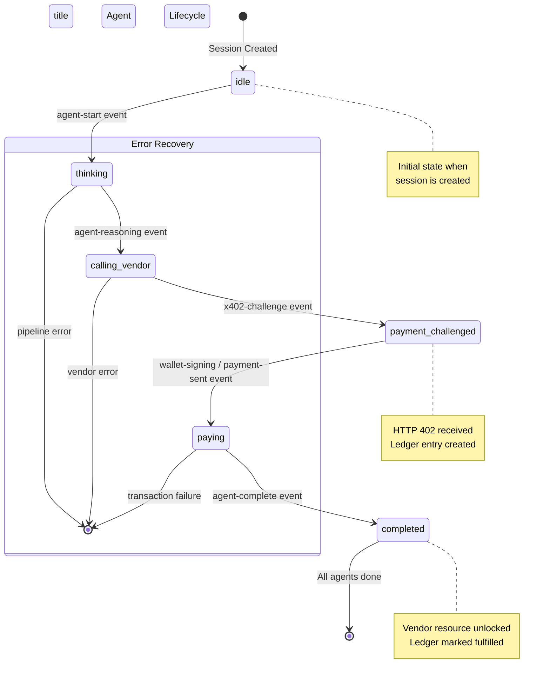
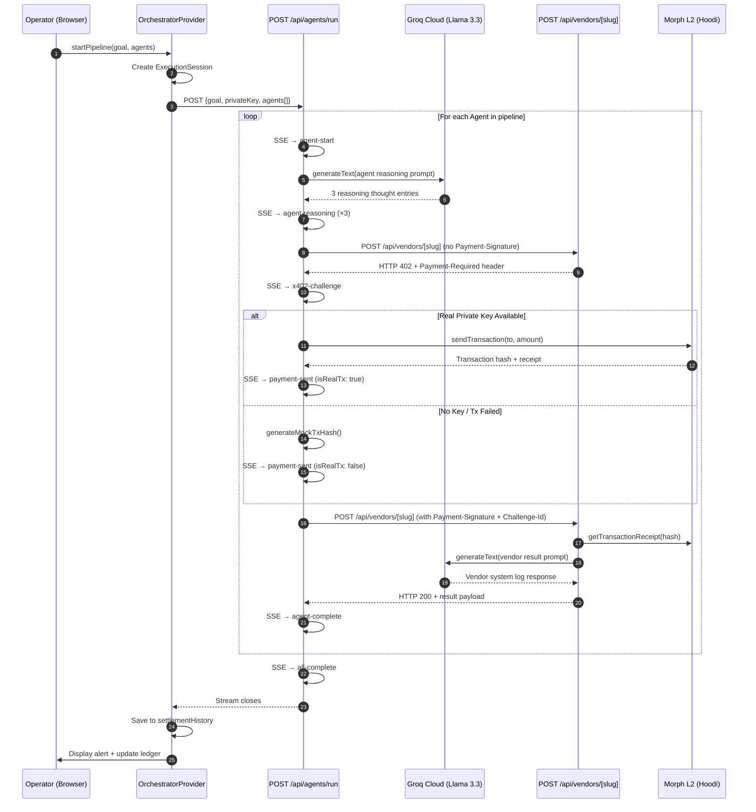
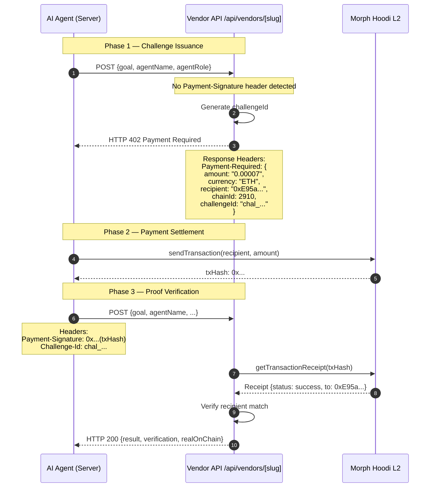
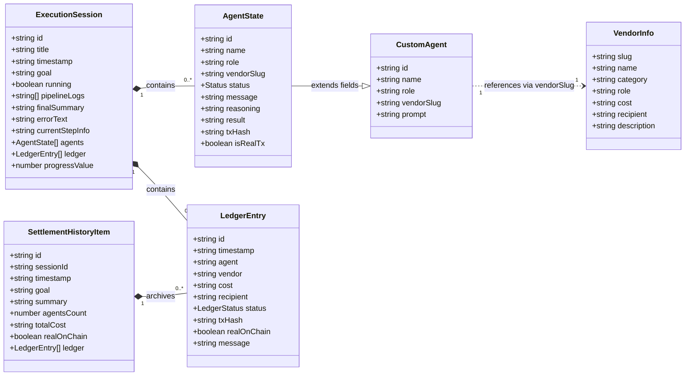
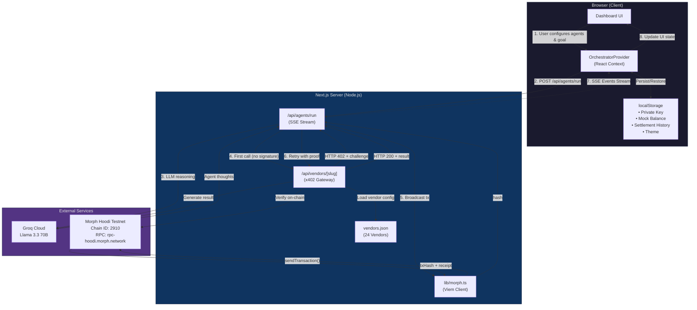

# x402stream — C4 Model Architecture

> **Machine-to-machine autonomous payment pipelines** powered by HTTP 402 challenges, settling transactions on the **Morph L2** blockchain network.

This document describes the architecture of **x402stream** using the [C4 Model](https://c4model.com) — a hierarchical set of diagrams that zoom in from a high-level system overview down to code-level structures.

---

## Table of Contents

- [Level 1 — System Context](#level-1--system-context)
- [Level 2 — Container](#level-2--container)
- [Level 3 — Component](#level-3--component)
  - [Frontend Components](#level-3a--frontend-components)
  - [Backend API Components](#level-3b--backend-api-components)
- [Level 4 — Code](#level-4--code)
  - [Orchestrator Provider State Machine](#level-4a--orchestrator-provider-state-machine)
  - [Agent Pipeline Execution Flow](#level-4b--agent-pipeline-execution-flow)
  - [x402 Payment Challenge Protocol](#level-4c--x402-payment-challenge-protocol)
  - [Type Definitions](#level-4d--type-definitions)
- [Data Flow — End-to-End Pipeline](#data-flow--end-to-end-pipeline)
- [Technology Stack](#technology-stack)

---

## Level 1 — System Context

The highest-level view showing **x402stream** and its relationships with external actors and systems.



**Key Relationships:**

| Relationship | Protocol | Purpose |
|---|---|---|
| Operator → x402stream | HTTPS | Configure agents, set goals, trigger pipelines |
| x402stream → Groq Cloud | HTTPS REST | LLM reasoning (agent thoughts & vendor results) |
| x402stream → Morph L2 | JSON-RPC | Broadcast txns, read balances, verify receipts |
| x402stream → Browser | HTTPS + SSE | Serve UI, real-time event streaming |

---

## Level 2 — Container

Zooms into x402stream to reveal the major containers (deployable units / runtime processes).



### Container Descriptions

| Container | Technology | Responsibility |
|---|---|---|
| **SPA** | React 19 + Next.js 16 + Motion | Interactive dashboard, agent workspace, SSE chat console, wallet widget, vendor browser |
| **API Routes** | Node.js + Vercel AI SDK | Agent pipeline orchestration, LLM reasoning, SSE event streaming, transaction broadcasting |
| **Vendor Simulator** | Next.js Dynamic Route | Issues HTTP 402 challenges, verifies payment signatures, generates LLM-powered vendor responses |
| **localStorage** | Browser Web API | Client-side persistence for wallet keys, mock balance, settlement history, theme |
| **Vendor Database** | Static JSON file | 24 preconfigured mock vendors with pricing, categories, and recipient addresses |

---

## Level 3 — Component

### Level 3a — Frontend Components

Zooms into the SPA container to show the React component architecture.



#### Frontend Component Inventory

| Component | File | Purpose |
|---|---|---|
| `RootLayout` | `app/layout.tsx` | Server component shell, font setup, global providers |
| `AppLayout` | `app/demo/_components/AppLayout.tsx` | Sidebar + header + mobile nav + alert stack |
| `HomePage` | `app/page.tsx` | Landing page with animated hero |
| `DemoPage` | `app/demo/page.tsx` | Main dashboard orchestration |
| `AgentWorkspace` | `app/demo/_components/AgentWorkspace.tsx` | Agent cards grid with CRUD |
| `ChatOrchestrator` | `app/demo/_components/ChatOrchestrator.tsx` | SSE chat console + session tabs |
| `AgentFormModal` | `app/demo/_components/AgentFormModal.tsx` | Create/edit agent dialog |
| `ChatMessageBubble` | `app/demo/_components/chat/ChatMessageBubble.tsx` | Individual chat message renderer |
| `AgentCard` | `app/demo/_components/AgentCard.tsx` | Single agent status card |
| `VendorStatus` | `app/demo/_components/VendorStatus.tsx` | Vendor grid with live status |
| `WalletWidget` | `app/demo/_components/WalletWidget.tsx` | Wallet balance + QR code |
| `TerminalLogs` | `app/demo/_components/TerminalLogs.tsx` | Raw terminal log viewer |
| `DashboardHeader` | `app/demo/_components/DashboardHeader.tsx` | Dashboard page header |
| `ActiveExecutionMonitor` | `app/demo/_components/ActiveExecutionMonitor.tsx` | Execution status indicator |
| `QRCodeContainer` | `app/demo/_components/QRCodeContainer.tsx` | QR code for wallet address |
| `OrchestratorProvider` | `app/demo/_providers/OrchestratorProvider.tsx` | Central React Context provider |
| `useWalletState` | `app/demo/_providers/_hooks/useWalletState.ts` | Wallet state management hook |
| `useCustomAgentsState` | `app/demo/_providers/_hooks/useCustomAgentsState.ts` | Agent CRUD hook |
| `useIsMobile` | `hooks/use-mobile.ts` | Responsive breakpoint detection |

---

### Level 3b — Backend API Components

Zooms into the Next.js API Routes and Vendor Simulator containers.



#### Backend Component Inventory

| Component | File | Purpose |
|---|---|---|
| Agent Run Route | `app/api/agents/run/route.ts` | Multi-agent pipeline orchestrator with SSE streaming |
| Vendor Route | `app/api/vendors/[slug]/route.ts` | x402 challenge issuer and payment verifier |
| Morph Library | `lib/morph.ts` | Viem-based blockchain integration layer |
| Vendor Database | `app/_data/vendors.json` | Static vendor configuration (24 entries) |
| Utilities | `lib/utils.ts` | `cn()` classname merging utility |

---

## Level 4 — Code

### Level 4a — Orchestrator Provider State Machine

The `OrchestratorProvider` is the central nervous system of the frontend. It manages all application state and processes SSE events from the backend.



#### SSE Event → State Transition Map

| SSE Event | Agent Status | Ledger Action | Side Effects |
|---|---|---|---|
| `agent-start` | `idle` → `thinking` | — | Log entry added |
| `agent-reasoning` | `thinking` → `calling_vendor` | — | Reasoning bubble displayed |
| `x402-challenge` | → `payment_challenged` | New entry: `challenged` | Challenge details logged |
| `wallet-signing` | → `paying` | — | Signing notification |
| `payment-sent` | → `paying` | Update: `paying` + txHash | Balance refresh (if real tx) |
| `agent-complete` | → `completed` | Update: `fulfilled` | Mock balance deducted |
| `all-complete` | — (session ends) | — | History saved, alert shown |
| `error` | — (session ends) | — | Error logged, pipeline stopped |

---

### Level 4b — Agent Pipeline Execution Flow

The core runtime sequence when a multi-agent pipeline is triggered.



---

### Level 4c — x402 Payment Challenge Protocol

The HTTP 402 challenge-response protocol implemented by the vendor simulator.



#### x402 Challenge Payload Schema

```
Payment-Required Header (JSON):
┌──────────────────────────────────────────┐
│ {                                        │
│   "amount":      "0.00007",    // ETH    │
│   "currency":    "ETH",                  │
│   "recipient":   "0xE95a...c065",        │
│   "chainId":     2910,         // Morph  │
│   "challengeId": "chal_bdo-unibank_..." │
│ }                                        │
└──────────────────────────────────────────┘
```

---

### Level 4d — Type Definitions

Core TypeScript interfaces that define the data model (`types/orchestrator.ts`).



#### Status Enumerations

```
AgentState.status:
  idle → thinking → calling_vendor → payment_challenged → paying → completed

LedgerEntry.status:
  challenged → paying → fulfilled
                      → failed
```

---

## Data Flow — End-to-End Pipeline

A comprehensive view of data flowing through the entire system during a single pipeline execution.



---

## Technology Stack

| Layer | Technology | Version | Purpose |
|---|---|---|---|
| **Framework** | Next.js | 16.2.6 | Full-stack React framework with App Router |
| **Runtime** | React | 19.2.4 | UI component library |
| **Language** | TypeScript | ^5 | Type-safe development |
| **Styling** | Tailwind CSS | ^4 | Utility-first CSS |
| **UI Components** | Shadcn/UI (Radix) | Latest | Accessible component primitives |
| **Animations** | Motion (Framer) | ^12.39 | Declarative animations |
| **AI/LLM** | Vercel AI SDK + Groq | ^6 / ^3 | LLM integration with Llama 3.3 70B |
| **Blockchain** | Viem | ^2.50 | EVM wallet, transactions, chain interaction |
| **Chain** | Morph Hoodi Testnet | Chain 2910 | L2 settlement layer |
| **Icons** | Lucide React | ^1.16 | Icon library |
| **Package Manager** | pnpm | — | Fast, disk-efficient package manager |

---

## File Structure Overview

```
x402stream/
├── app/
│   ├── _data/
│   │   └── vendors.json              # 24 mock vendor definitions
│   ├── api/
│   │   ├── agents/
│   │   │   └── run/
│   │   │       └── route.ts          # Multi-agent pipeline (SSE)
│   │   └── vendors/
│   │       └── [slug]/
│   │           └── route.ts          # x402 vendor simulator
│   ├── demo/
│   │   ├── _components/              # Dashboard UI components
│   │   │   ├── AgentCard.tsx
│   │   │   ├── AgentFormModal.tsx
│   │   │   ├── AgentWorkspace.tsx
│   │   │   ├── AppLayout.tsx
│   │   │   ├── ChatOrchestrator.tsx
│   │   │   ├── DashboardHeader.tsx
│   │   │   ├── QRCodeContainer.tsx
│   │   │   ├── TerminalLogs.tsx
│   │   │   ├── VendorStatus.tsx
│   │   │   ├── WalletWidget.tsx
│   │   │   ├── ActiveExecutionMonitor.tsx
│   │   │   └── chat/
│   │   │       └── ChatMessageBubble.tsx
│   │   ├── _providers/
│   │   │   ├── OrchestratorProvider.tsx  # Central state context
│   │   │   └── _hooks/
│   │   │       ├── useCustomAgentsState.ts
│   │   │       └── useWalletState.ts
│   │   ├── ledgers/                   # Settlement history page
│   │   ├── settings/                  # Wallet configuration page
│   │   ├── vendors/                   # Vendor catalog page
│   │   └── page.tsx                   # Main dashboard page
│   ├── globals.css
│   ├── layout.tsx                     # Root layout
│   └── page.tsx                       # Landing page
├── components/
│   └── ui/                            # Shadcn/UI primitives (23 components)
├── hooks/
│   └── use-mobile.ts                  # Responsive breakpoint hook
├── lib/
│   ├── morph.ts                       # Morph L2 blockchain library
│   └── utils.ts                       # Classname utility
├── types/
│   └── orchestrator.ts                # Core TypeScript interfaces
├── public/                            # Static assets
├── package.json
├── next.config.ts
├── tsconfig.json
└── ARCHITECTURE.md                    # This document
```

---

*Architecture documented using the [C4 Model](https://c4model.com) by Simon Brown.*
*Last updated: May 2026*
